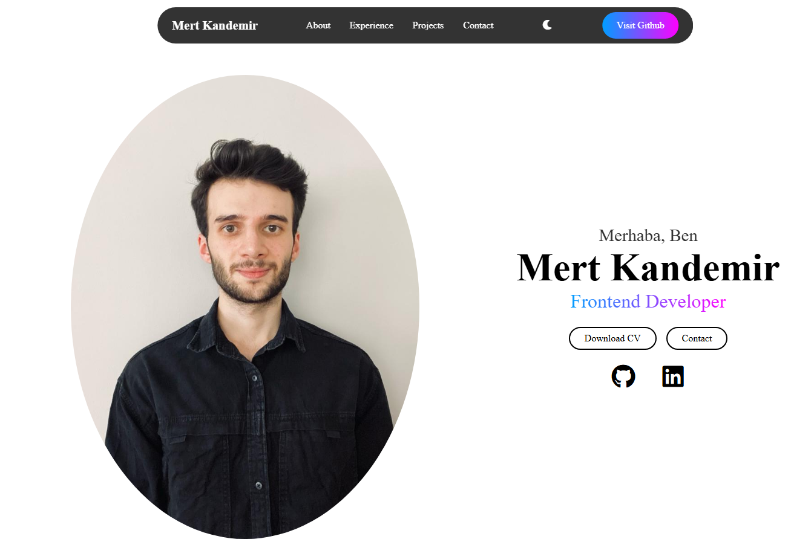
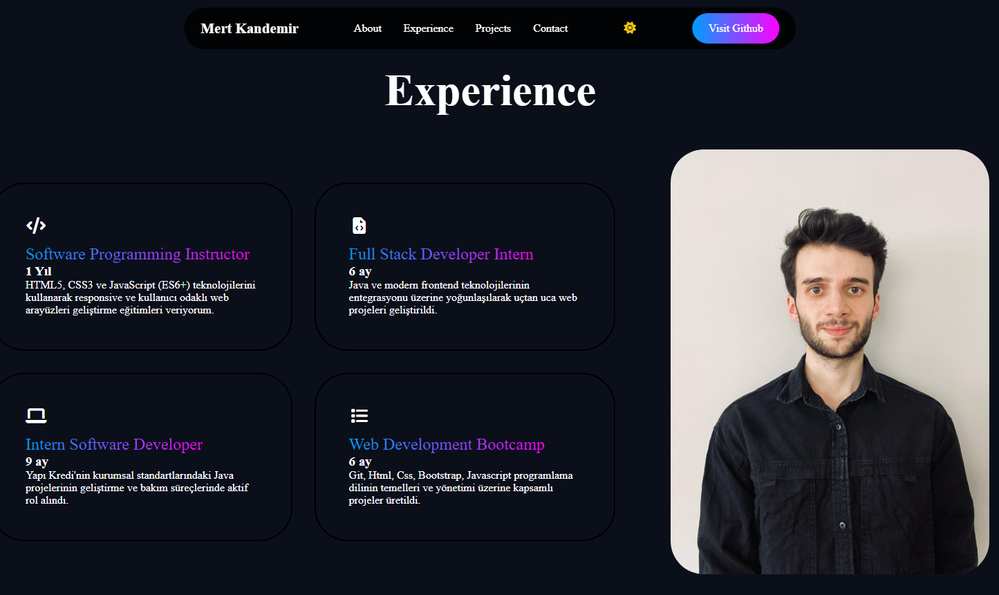
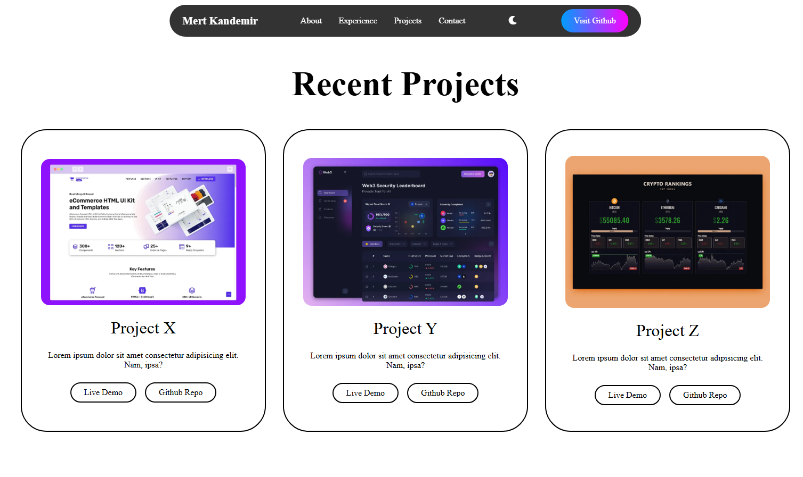
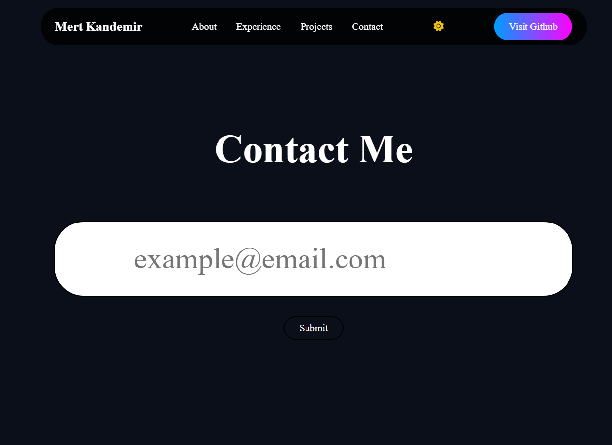

# 🌐 My Personal Portfolio Website

Bu proje, modern web teknolojileri kullanılarak geliştirilmiş, kullanıcı dostu arayüze ve dinamik karanlık mod (Dark Mode) desteğine sahip kişisel portfolyo web sitemdir. 

---

## ✨ Özellikler

- **📱 Tam Duyarlı (Responsive) Tasarım:** Mobil, tablet ve masaüstü cihazlarla %100 uyumlu mimari.
- **🚀 Performans Odaklı:** Saf CSS (Vanilla CSS) ve JavaScript kullanılarak hızlı yükleme süreleri hedeflenmiştir.
- **📂 Bölümler:** Hakkımda, Deneyim, Projeler ve İletişim alanlarından oluşan tek sayfa (Single Page) yapısı.
- **🌓 Dinamik Karanlık Mod:** Tek bir tıklama ile Ay/Güneş ikonları arasında geçiş yaparak göz yormayan bir deneyim sunar.
---

## 🛠️ Kullanılan Teknolojiler

- **Frontend:** HTML5, CSS3 (Custom Variables), JavaScript (ES6+)
- **İkonlar:** Font Awesome 6.5.1
- **Fontlar:** Google Fonts (Poppins)
- **Geçiş Efektleri:** CSS Transitions & Flexbox/Grid Layout

---

## 📸 Ekran Görüntüleri

---

## ⚙️ Kurulum ve Çalıştırma

Projeyi yerel bilgisayarınızda çalıştırmak için şu adımları izleyebilirsiniz:

1. Depoyu klonlayın:
git clone [https://github.com/mertkanfe/My-Website.git](https://github.com/mertkanfe/My-Website.git)

2. cd My-Website

3. index.html dosyasını tarayıcınızda açın.

